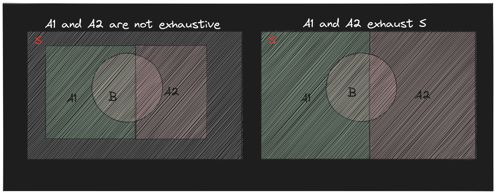

You are at your local cafe waiting for your possible soul-mate when suddenly _buzz buzz_, the phone vibrates, "I will be there soon! got stuck in traffic :(" the text reads. You unsurprisingly look at the wrist watch, it is 17mins past 6pm, the decided time, _sigh...._ you sit back in your chair as you recall your prior dates,


"KJ was 10mins late, Sarah 30, Linda 15, Anna 20, and yeah how could I forget Ella who was 1 hour late." you said to yourself.  


You decide that you aren't going to wait any longer than 25mins this time around, so intuitively, you calculate that the chance that you will leave alone just from your prior experiences is
$$\text{No. of dates who came past 25mins}\over\text{Total no. of dates that came late}$$
which is $2/5$, or is it?


The above example of probability in daily-life shows that we all have some notion of probability, The aim of this write-up is to formalise it mathematically by introducing necessary vocabulary, axioms and theorems.


Uncertainity in determining the outcome of any process, termed as **experiment**, motivates us to analyse the experiment quantitatively by repeating the experiment over and over again to gather the list of all possible outcomes and determine numbers, called **probabilities**, for one outcome or a set of outcomes that tells us the chance, if the experiment was repeated in a similar setting, of that thing to appear again.

## Vocabulary

Let us break the above example down and build a common vocabulary to work with,

We call a single performance of an experiment a **trial** and each possible result an **outcome**. Comparing with the above example **every date is a trial**, no punn intended and all the delays in arrival "KJ was 10mins late, Astra 30, Skye 15........" each one of these are **outcomes**.

The set $\{10,30,15,20,60\}$ is then called the sample space of the experiment. Thus, the **sample space** $S$ of the experiment is then the set of all possible outcomes of an individual trial.

Most often, one is not interested in individual outcomes but in whether an outcome fits a certain description, say your date being late more than 25mins $\{25,30,60\}$; or more mathematically, belongs to a given subset A of the sample space S; Any **event** $A$ is a subset of the sample space $S$. $A \subseteq S$

## Axioms and Theorems

1.  More quantitatively, if an experiment has a total of $n_S$ outcomes in the sample space S, and $n_A$ of these outcomes correspond to the event $A$, then the probability that event $A$ will occur is $$P(A) = {n_A \over n_S}$$$0 \leq P(A) \leq 1$, for any event $A$ in $S$. $P(S)=1$ 
2.  If A and B are two events in S then,$$ P(A\cup B) = P(A) + P(B) - P(A \cap B)$$ if $A$ and $B$ are **mutually exclusive**, $A \cap B = \phi \implies P(A\cup B) = P(A) + P(B)$.


In the general case, When the probabilities are combined to calculate the probability for the union of the $n$ general events, the result, which may be proved by induction upon $n$, is $$P\left(\bigcup_i^nA_i \right) = \sum_i^nP(A_i) - \sum_{i,j}P(A_i \cap A_j) + \sum_{i,j,k} P(A_i\cap A_j\cap A_k) -\dots+(-1)^{n+1}P\left(\bigcap_i A_i\right)$$



3.  **Complement Law:** We define complement $\bar{A}$ of an event $A$ in $S$, st $\bar{A} \cup A = S$ and $\bar{A}\cap A = \phi$ $$P(A) = 1 - P(\bar{A})$$
4.  $P(A \cap B)$ where $A$ (say) is the union of a set of $n$ **mutually exclusive events** $A_i$,$$\begin{aligned}A \cap B &= \bigcup_{i} A_i \cap B \\\P(A \cap B) &=\sum_{i} P(A_i \cap B)\end{aligned}$$
    In the case where $A_i$ exhaust all possible outcomes, $A = S$

$$P(B) = \sum_{i} P(A_i \cap B)$$

## Conditional Probability

Conditional probability answers the question


"What is the probability of occurence of an event A _given_ that some other event B has occured?"


$$\begin{aligned}P(A \cap B) &= P(A)P(B|A) \\\ &= P(B)P(A|B) \\\\[0.5cm]P(A|B) &= {P(A\cap B)\over P(B)} \\\ P(B|A) &= {P(A\cap B)\over P(A)}\end{aligned}$$

In terms of Venn diagrams, we may think of $P(B|A)$ as the probability of $B$ in the reduced sample space defined by $A$; Introducing the condition of A occuring collapses the sample space to $A$, we then look for outcomes within $A$ that also belong to $B$ (that is $A \cap B$).
Thus, if two events $A$ and $B$ are mutually exclusive then $$P(A|B)= 0 = P(B|A)$$
Also, if the occurence of one event, say A, does not affect the probability of occurence of the other, B, then the events are called **independent events**,
$$P(B/A) = P(B) \implies P(A\cap B) = P(A)P(B)$$

## Summary

Let us summarise this discussion with the example that we started with. Let $E$ be the event that $\text{You leave alone}$ , we calculated $P(E) = 1/2$, the probability of you leaving alone, BUT we forgot to take into account one essential piece of information that should affect this probability,

> **"You unsurprisingly look at the wrist watch, it is 17mins past 6pm"**

Your date is already 17mins late, so your _sample space_ {10,30,15,20,60} has to be updated to {30,20,60}, therefore what we actually calculate is $P(E|A) = 1/3$, where A is the event that the date arrives after 17mins. Mathematically, this is stated as,

$$\begin{aligned} P(E|A) &= P(\text{He will leave alone given that the date arrives after 17mins})\\\\[0.5cm] &= {P(\text{He leaves alone and the date is 17mins late}) \over P(\text{The date arrives after 17mins })} = \frac{1/5}{3/5} = \frac{1}{3}\end{aligned}$$

For diving into details of probability theory, I recommend **"A First Course in Probability by Sheldon Ross"**.
